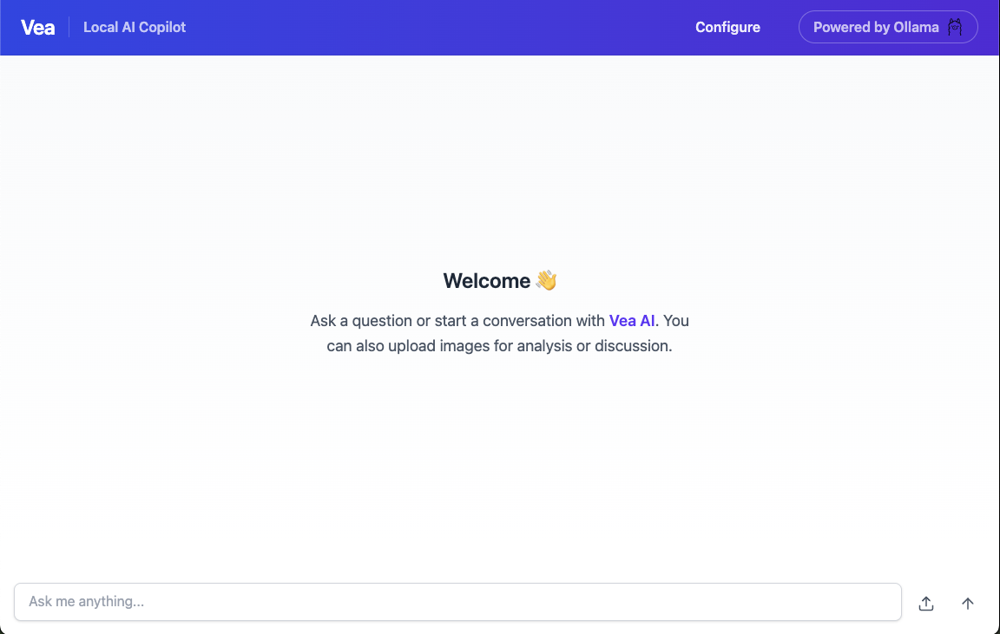
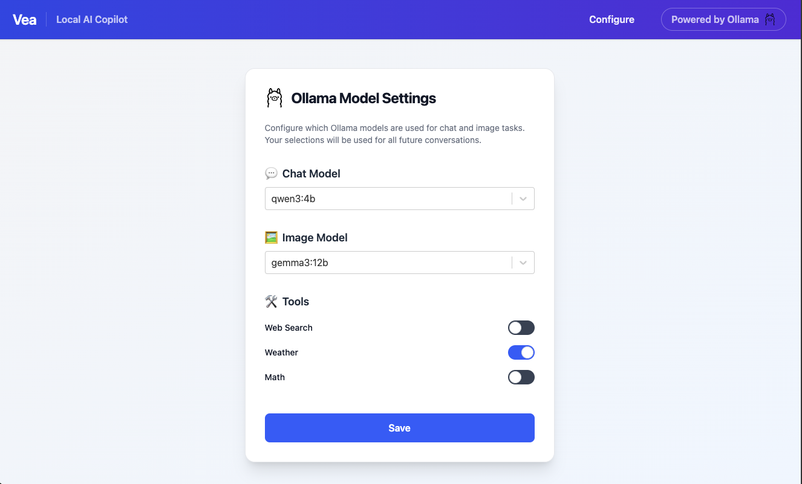

# Vea - Local AI Copilot 🤖

[](LICENSE)

Learn more about Ollama at [https://ollama.com/](https://ollama.com/) for deploying LLMs locally

## Table of Contents

- [Overview](#overview)
- [Features](#features)
- [Prerequisites](#prerequisites)
- [Installation](#installation)
- [Configuration](#configuration)
- [Usage](#usage)
- [Project Structure](#project-structure)
- [Limitations](#limitations)
- [License](#license)

## Overview

Vea is a local AI copilot that seamlessly integrates with your Ollama installations. It provides a modern, web-based interface for interacting with local AI models while leveraging additional capabilities such as web search, mathematical operations, weather information, and image analysis. You can switch to closed-source models like OpenAI and Anthropic by editing the configuration file at `backend/config/agent.yaml`. Please edit the configuration file or complete the setup on the configuration page before submitting your first query.

## Features

- Web search capabilities powered by Tavily API
- Real-time weather information using OpenWeather API
- Mathematical calculations including arithmetic and trigonometric functions
- Multi-modal vision capabilities
- Context-aware responses with current date/time integration
- Modular architecture with LangGraph support and LangSmith observability
- Support markdown for programming languages
- Visible thinking traces when using a reasoning model

## Tech Stack

- **Backend**: FastAPI, LangGraph, LangSmith, and Ollama
- **Frontend**: React, TypeScript, TailwindCSS, and Vite

## Prerequisites

To install and run Vea, ensure you have the following:

- Tavily API key
- OpenWeather API key
- Ollama installed and running

## Installation

1. Clone the repository:

```bash
git clone https://github.com/therealcyberlord/Vea.git
cd Vea
```

2. Install Python dependencies using UV:

```bash
cd backend
uv sync
source .venv/bin/activate
```

3. Install frontend dependencies:

```bash
cd frontend
npm install
```

## Configuration

Create a `.env` file in the `backend` directory with the following configuration:

```
TAVILY_API_KEY=your_tavily_api_key
OPENWEATHER_API_KEY=your_openweather_api_key
LANGSMITH_API_KEY=your_langsmith_api_key
LANGSMITH_TRACE=true
```

You can obtain API keys from:

- Tavily API: https://tavily.com/
- OpenWeather API: https://openweathermap.org/api
- LangSmith: https://www.langchain.com/langsmith

## Usage

1. Start the FastAPI backend server:

```bash
cd backend
uvicorn main:app --reload
```

2. Start the frontend development server:

```bash
cd frontend
npm run dev
```

The application will be accessible at `http://localhost:3000`

## Project Structure

```
Vea/
├── backend/           # Backend implementation
│   ├── agent/         # Main AI agent
│   ├── tools/         # Tools for function-calling
│   ├── config/        # Configuration files
│   ├── utils/         # Utility functions
│   ├── models/        # Pydantic data models
│   └── .env           # Environment variables
├── frontend/          # Frontend application
│   ├── src/           # TypeScript source code
│   ├── public/        # Static assets
│   └── vite.config.ts # Vite configuration
```

## Screenshots

Here's a look at Vea's chat interface:



The configuration page allows you to customize your models:



Vea supports image inputs:


It also supports coding examples with markdown:


You can view the AI's thinking process if you are using a reasoning model:


## Limitations

- Memory persistence is stored in-memory and is not persisted to an external database
- Vision capabilities depend on the underlying model's capabilities
- Temperature configuration functionality is currently a work-in-progress
- Better handling of long-term memory

## Contributing

Feel free to contribute to Vea! Whether it's adding new features, improving existing ones, or fixing bugs, your contributions are welcome. Please feel free to submit a pull request or open an issue for any enhancements you'd like to see.

## License

This project is licensed under the MIT License - see the [LICENSE](LICENSE) file for details.
